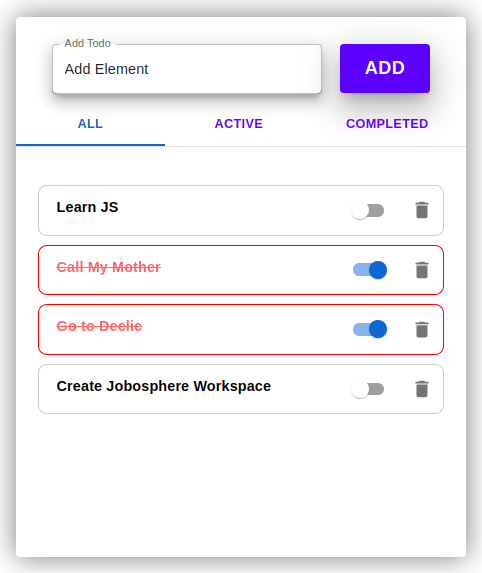

# [react-firebase-todo](https://react-firebase-todo-1ffa7.web.app/)

## Steps

- [x] [Create a new project](https://fr.reactjs.org/docs/create-a-new-react-app.html)
- [x] [Make a project view with material-ui](https://mui.com/material-ui/)
- [x] Save todos in array
- [x] Save todos in local storage
- [x] Integrate a database [Firebase ](https://firebase.google.com/docs/firestore)
- [x] Hosting the project on [Firebase ](https://firebase.google.com/docs/hosting)

## Installation

```shell
git clone git@github.com:Namountougou/todo-list.git
cd react-firebase-todo
npm install
npm start
```

Runs the app in the development mode.\
Open [http://localhost:3000](http://localhost:3000) to view it in your browser.



## Deployment Link

# [https://fir-todo-471dc.web.app/](https://fir-todo-471dc.web.app/)
